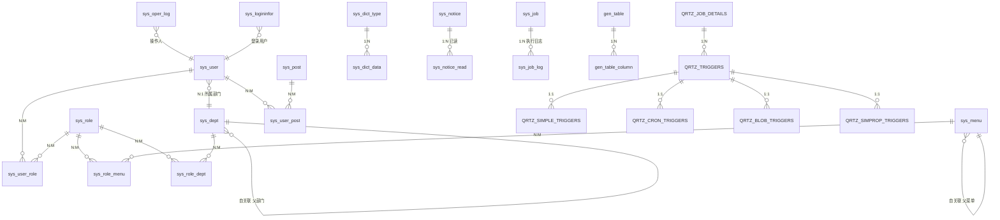

# 数据库 ER 关系图

> 本项目数据库表来自 Flyway 迁移脚本：`V1__ruoyi_base_tables.sql`（若依基础表）、`V2__quartz_tables.sql`（Quartz 表）、`V3__create_ai_devops_calc_list.sql`（ai-devops 计算历史表 + sys_menu 菜单）。业务表从 V3 起编号，前缀 `ai_devops_`。

## 一、完整 ER 关系图



## 二、表清单与用途

### 2.1 RBAC 权限模型（sys_）

| 表 | 用途 |
|------|------|
| `sys_user` | 用户 |
| `sys_role` | 角色 |
| `sys_menu` | 菜单/权限（树形，自关联） |
| `sys_dept` | 部门（树形，自关联） |
| `sys_post` | 岗位 |
| `sys_user_role` | 用户-角色（N:M） |
| `sys_role_menu` | 角色-菜单（N:M） |
| `sys_role_dept` | 角色-数据权限部门（N:M） |
| `sys_user_post` | 用户-岗位（N:M） |

### 2.2 字典与配置

| 表 | 用途 |
|------|------|
| `sys_dict_type` | 字典类型 |
| `sys_dict_data` | 字典数据 |
| `sys_config` | 系统参数（如验证码开关） |

### 2.3 通知公告

| 表 | 用途 |
|------|------|
| `sys_notice` | 通知公告 |
| `sys_notice_read` | 公告已读记录 |

### 2.4 日志

| 表 | 用途 |
|------|------|
| `sys_oper_log` | 操作日志 |
| `sys_logininfor` | 登录日志 |

### 2.5 定时任务

| 表 | 用途 |
|------|------|
| `sys_job` | 定时任务 |
| `sys_job_log` | 任务执行日志 |
| `QRTZ_*`（11 张） | Quartz 调度引擎内置表（详见 `quartz.sql`） |

### 2.6 代码生成

| 表 | 用途 |
|------|------|
| `gen_table` | 代码生成-表信息 |
| `gen_table_column` | 代码生成-字段信息 |

## 三、ai-devops 业务表

### 3.1 计算历史表

`ai_devops_calc_list`（V3 迁移创建，计算器功能落库用）：

| 字段 | 类型 | 说明 |
|------|------|------|
| `calc_id` | bigint(20) | 主键（自增） |
| `first_number` | double(16,4) | 第一个数 |
| `second_number` | double(16,4) | 第二个数 |
| `operator` | char(1) | 运算符（+ - * /） |
| `result` | double(16,4) | 运算结果 |
| `status` | char(1) | 状态（0 正常 1 停用） |
| `del_flag` | char(1) | 删除标志（0 存在 2 删除，软删除） |
| `create_by` / `create_time` | varchar(64) / datetime | 创建者 / 创建时间（数据隔离依据：查询按 `create_by` = 当前用户） |
| `update_by` / `update_time` | varchar(64) / datetime | 更新者 / 更新时间 |
| `remark` | varchar(500) | 备注 |

**关系**：本表通过 `create_by` 与 `sys_user.user_name` 逻辑关联（非物理外键，若依审计字段惯例）。计算历史按用户隔离——查询 SQL 强制 `create_by = #{createBy}`，用户只能看自己的记录。菜单/权限挂在 `sys_menu`（V3 同脚本插入 menu_id 2020-2025）。

```
ai_devops_calc_list }o--|| sys_user : "create_by → user_name（逻辑关联，数据隔离）"
```

### 3.2 后续新增业务表约定

- 前缀 `ai_devops_`，与 `sys_`/`gen_` 区分。
- 含基础审计字段（`create_by`/`create_time`/`update_by`/`update_time`/`del_flag`）。
- 迁移脚本放 `ai-devops/src/main/resources/db/migration/V{N}__<desc>.sql`，业务表从 V3 起编号。
- 新增表后在本节补充 ER 关系。
